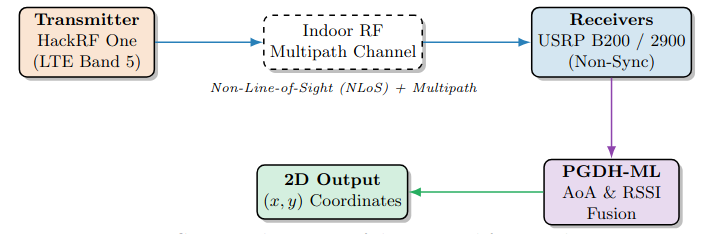
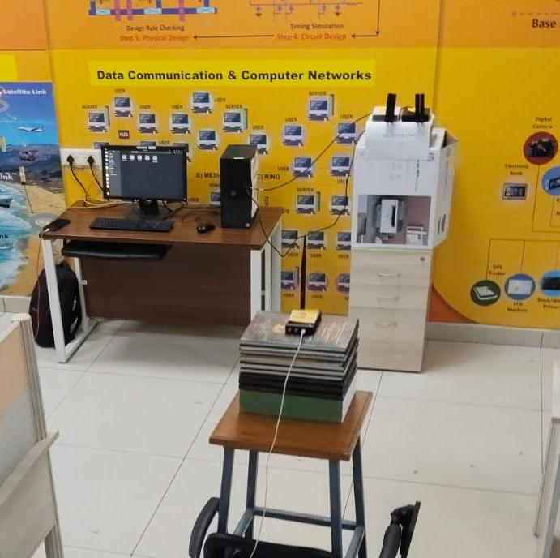
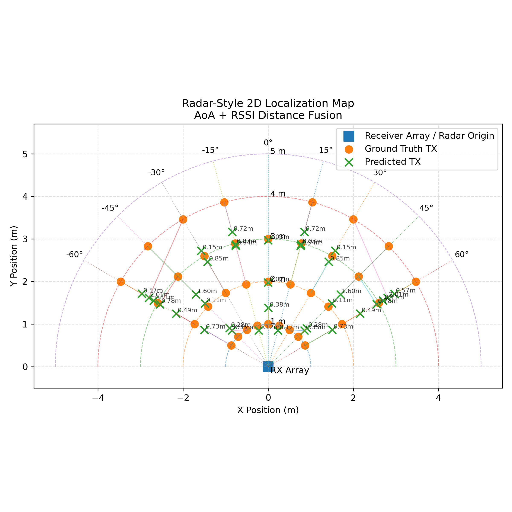
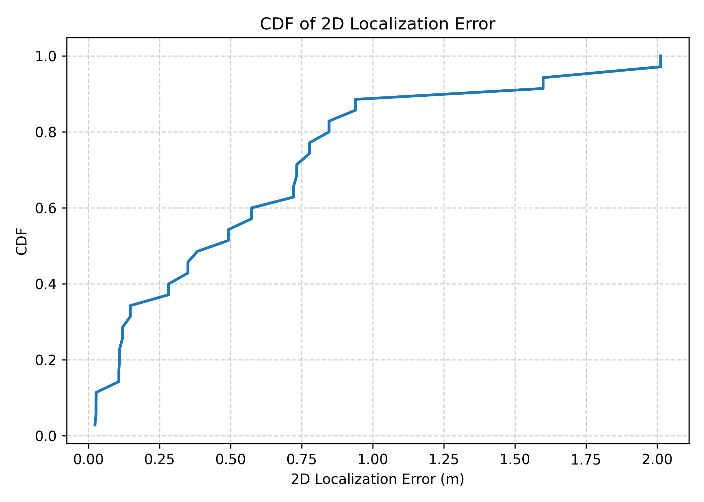
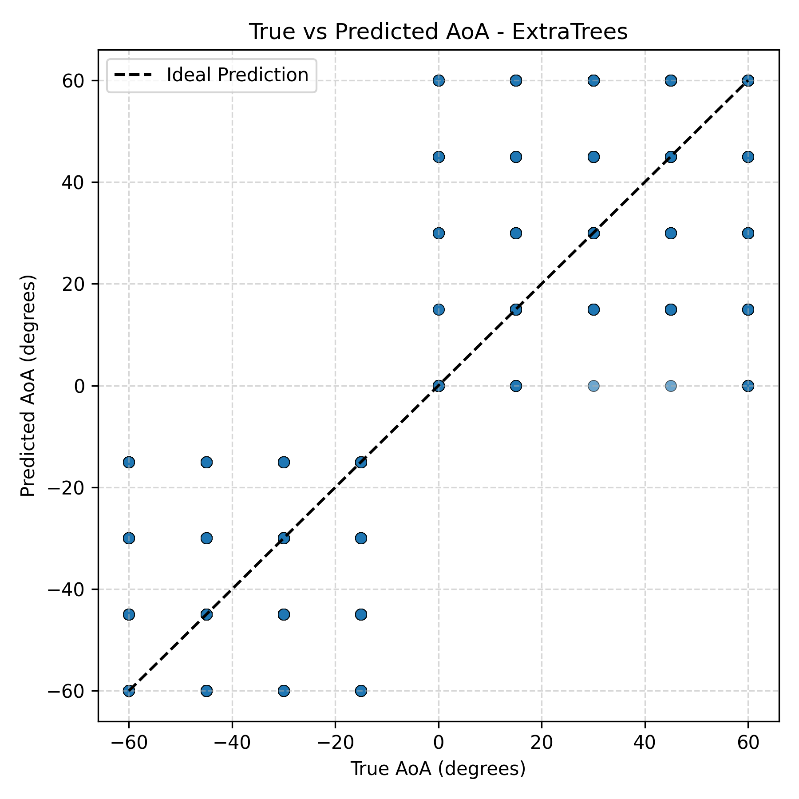
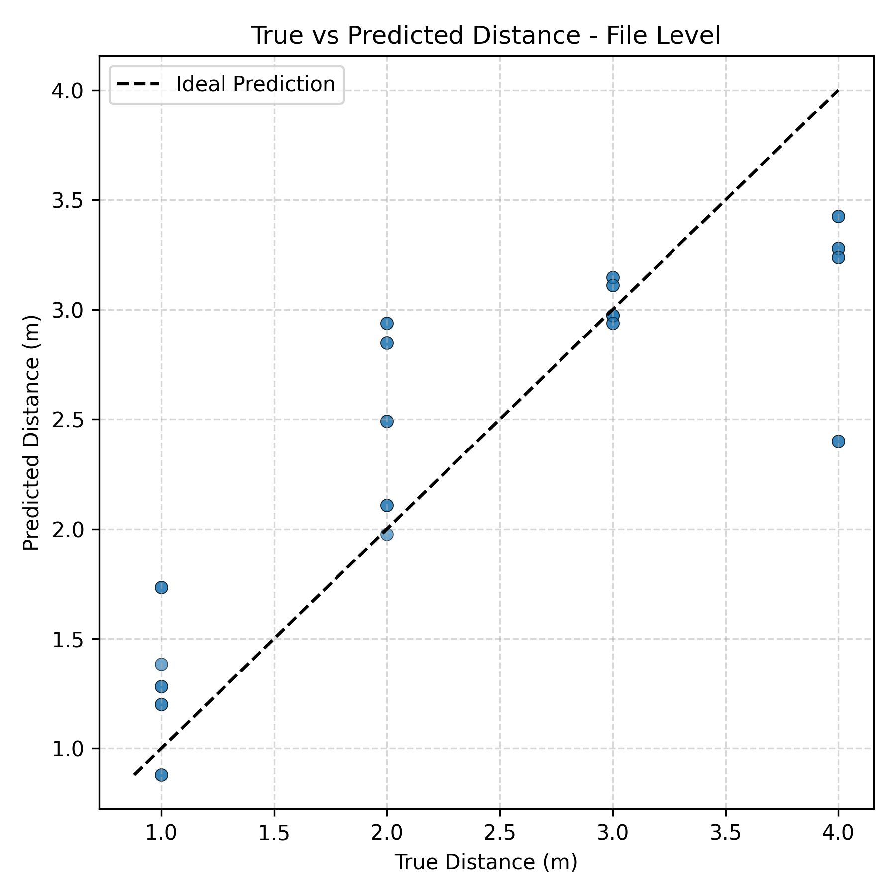
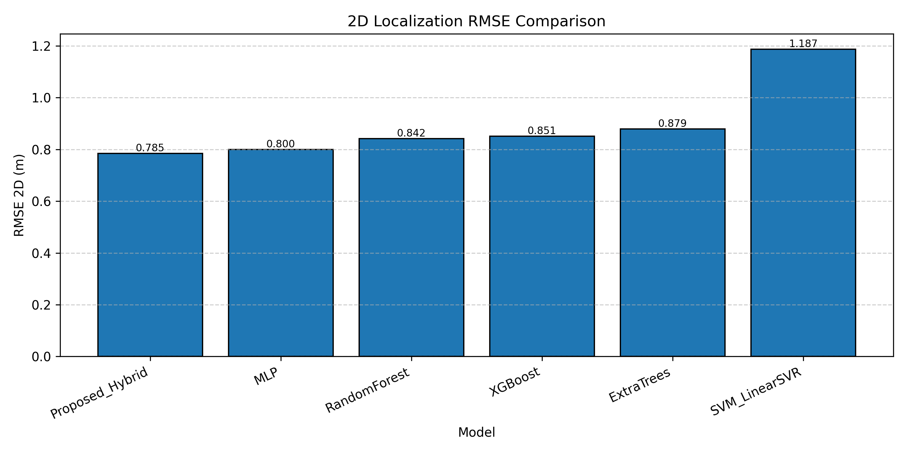
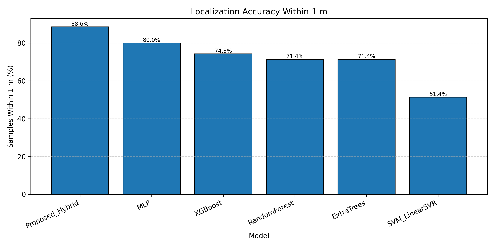

# ML-Assisted 2D Localization using SDR-Based ISAC System with AoA and RSSI Estimation 

## Overview

This project presents a machine learning-assisted indoor 2D localization system using Software Defined Radio (SDR)-based Integrated Sensing and Communication (ISAC) architecture. The system estimates user/device location using Angle of Arrival (AoA) and Received Signal Strength Indicator (RSSI) extracted from real-world RF IQ samples.

The project combines wireless communication, RF signal processing, machine learning, and SDR hardware implementation for intelligent localization in next-generation wireless systems.

The implementation uses real IQ data collected from Ettus USRP B200 and NI USRP B2900 SDR platforms operating at 850 MHz.


---

# Project Objectives

- Design an SDR-based indoor localization framework
- Estimate AoA using antenna phase information
- Estimate RSSI-based distance characteristics
- Generate ML-ready datasets from raw IQ samples
- Develop hybrid AoA + RSSI localization models
- Compare machine learning algorithms for localization accuracy
- Build a reproducible RF sensing and localization pipeline

---

# Key Features

- Real SDR hardware implementation
- RF IQ sample acquisition and preprocessing
- Covariance matrix-based feature extraction
- AoA estimation using antenna pair analysis
- RSSI-assisted localization
- Hybrid localization framework
- Machine learning-assisted coordinate prediction
- Processed dataset generation pipeline
- GNU Radio + Python integration
- Real-world wireless sensing workflow

---

# Hardware Setup
The experimental setup consists of SDR-based RF transmission and reception using Ettus USRP B200 and NI USRP B2900 platforms configured for indoor localization experiments.

## SDR Experimental Setup


## SDR Platforms(Receiver)

- Ettus USRP B200
- NI USRP B2900
## Transmitter
- HackRF One

## Operating Parameters

| Parameter | Value |
|---|---|
| Carrier Frequency | 850 MHz |
| Environment | Indoor |
| Localization Type | 2D Localization |
| Signal Type | IQ Samples |
| SDR Interface | GNU Radio |

---

# Antenna Configuration

| Antenna Pair | Spacing |
|---|---|
| RX2-TX/RX | 12 cm |
| RX2-TX/RX | 18 cm |
| TX/RX-RX2 | 12 cm |
| TX/RX-TX/RX | 6 cm |

The antenna spacing configuration was used for AoA estimation and RF phase difference analysis.

---

# System Workflow

The complete localization pipeline consists of:

1. RF Signal Transmission
2. IQ Sample Acquisition using SDRs
3. Signal Preprocessing
4. Covariance Matrix Computation
5. AoA Feature Extraction
6. RSSI Estimation
7. Dataset Generation
8. Machine Learning Model Training
9. 2D Coordinate Prediction
10. Localization Performance Evaluation

---

# Signal Processing Pipeline

## IQ Data Acquisition

Raw IQ samples were collected using SDR hardware for multiple distances and angular orientations in indoor environments.

## Feature Extraction

The following RF features were extracted:

- Phase Difference
- Covariance Matrix Features
- RSSI Features
- Antenna Pair Characteristics
- Statistical Signal Features

## Dataset Generation

The raw SDR IQ samples were converted into machine learning-ready datasets for supervised learning-based localization.

---

# Machine Learning Models

The following machine learning algorithms were evaluated:

- Random Forest Regressor
- Extra Trees Regressor
- Hybrid AoA-RSSI Estimation Models

The models were trained for:

- AoA estimation
- RSSI prediction
- 2D localization coordinate prediction

---

# Repository Structure

```text
ML_2D_Localization_SDR_ISAC/
│
├── data/
│   ├── processed/
│   └── raw_iq/
│
├── docs/
│
├── gnuradio/
│
├── scripts/
│   ├── preprocessing/
│   ├── models/
│   ├── evaluation/
│   └── utils/
│
├── Results_ML/
│
├── run_full_pipeline.py
├── run_hybrid.sh
├── config.yaml
├── requirements.txt
└── README.md
```

---

# Technologies Used

## Programming and ML

- Python
- Scikit-learn
- NumPy
- Pandas
- Matplotlib

## SDR and RF Tools

- GNU Radio
- Ettus UHD
- NI USRP Drivers

## Operating System

- Ubuntu Linux

---

# Experimental Results

The project evaluates:

- Localization Accuracy
- AoA Estimation Performance 
- RSSI Prediction Accuracy
- Coordinate Prediction Error
- Hybrid Localization Performance

Generated outputs include:

- Localization plots 
- Error analysis graphs 
- AoA estimation results 
- RSSI estimation plots 
- Model evaluation metrics  

---

# Applications

- Indoor Positioning Systems
- 6G Integrated Sensing and Communication (ISAC)
- Smart Environments
- Wireless RF Sensing
- Autonomous Systems
- IoT Localization
- Intelligent Wireless Networks

---

# Future Improvements

- Real-time localization deployment
- Deep learning-based RF sensing
- CSI-assisted localization
- Beamforming-assisted AoA estimation
- Multi-user localization
- Edge AI integration
- Real-time SDR inference pipeline

---

# How to Run

## Clone Repository

```bash
git clone https://github.com/SriharshaMandru/ML_2D_Localization_SDR_ISAC.git
```

## Navigate to Project

```bash
cd ML_2D_Localization_SDR_ISAC
```

## Install Dependencies

```bash
pip install -r requirements.txt
```

## Run Full Pipeline

```bash
python run_full_pipeline.py
```

---

# Research Focus Areas

- Wireless Communication
- RF Signal Processing
- Software Defined Radio
- Machine Learning for Wireless Systems
- ISAC Systems
- Indoor Localization
- 6G Wireless Technologies

---

# Author

## Mandru Sriharsha

M.Tech – Communication Systems

Areas of Interest:
- Wireless Communication
- SDR Systems
- RF Signal Processing
- Machine Learning for Wireless Networks
- 6G ISAC Systems

---

# License

This project is intended for academic and research purposes.
